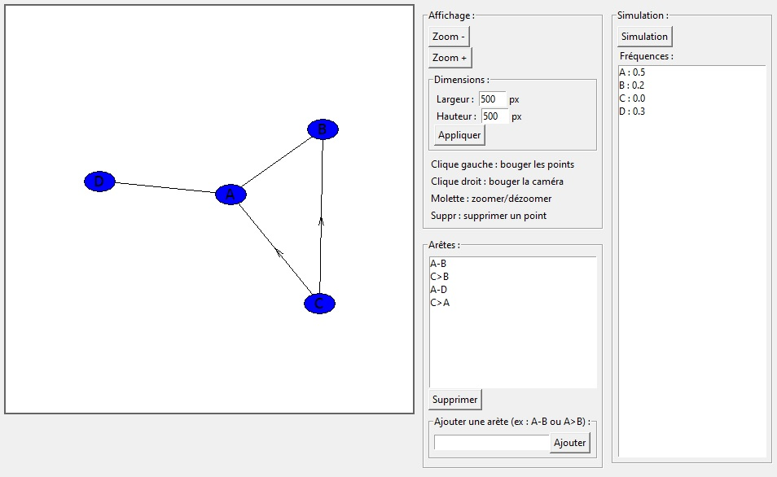

# Python-Graph

This is a program that allows you to create graphs and do statistics on them.
## Features
- Visual representation of the graphs
- Two-way or one-way edges
- End-point probability calculation
## Installation
1. Download the repository by clicking on `Code > Download ZIP`
2. Extract the ZIP file
3. Run `main.pyw`
## Requirements
- Python 3.7
- Python `tkinter` library
- Python `random` library
- Python `math` library